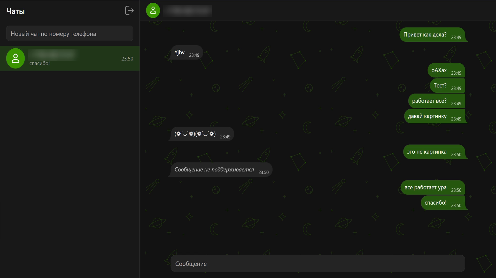
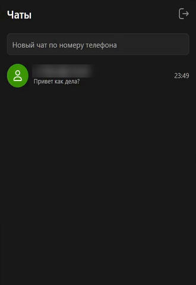
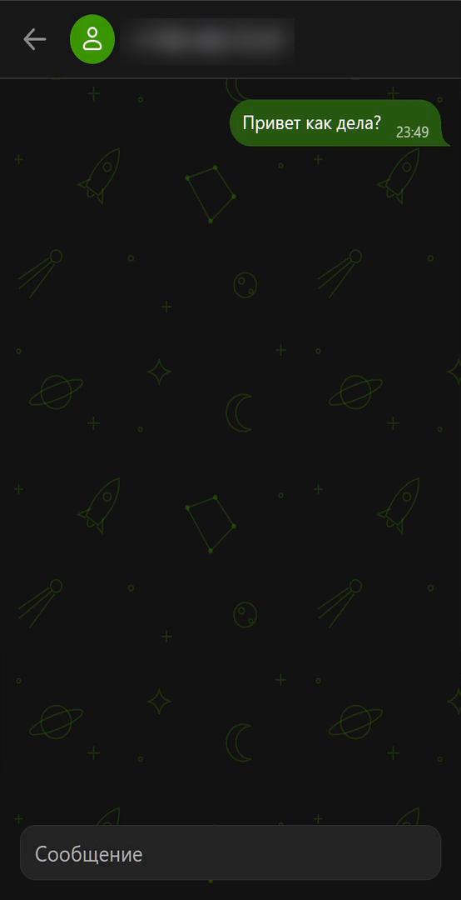
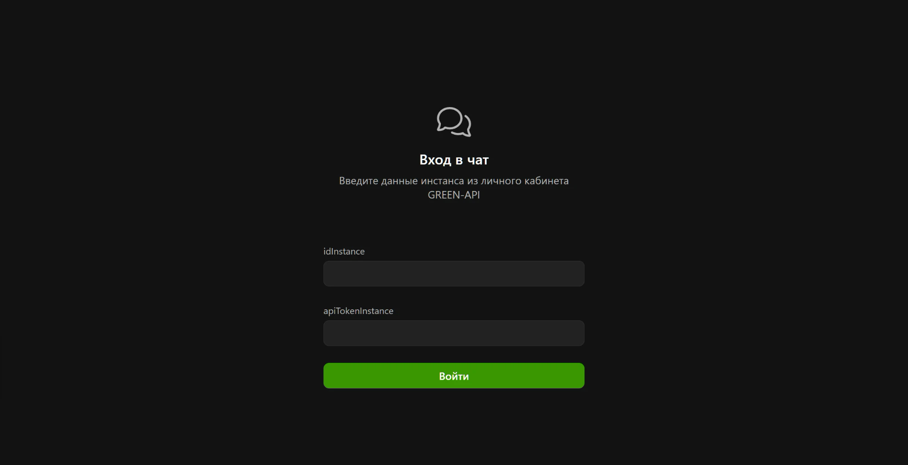
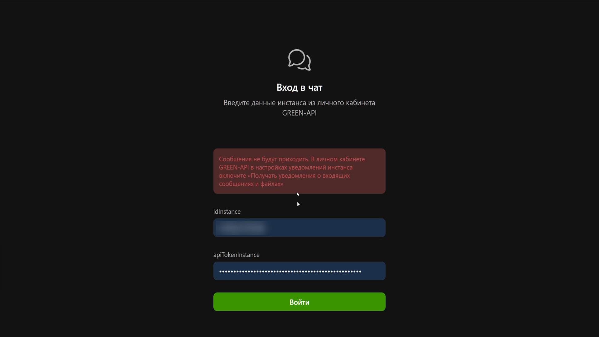
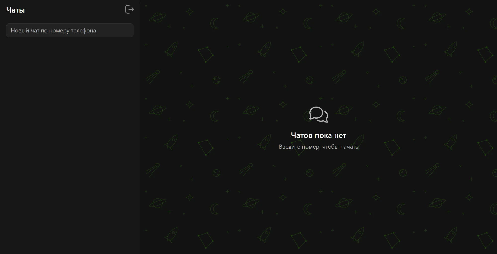

# GREEN-API Chat

Веб-чат для отправки и получения текстовых сообщений в Telegram через [GREEN-API](https://green-api.com/telegram). Внешний вид повторяет тёмную тему [web.max.ru](https://web.max.ru/): цвета и фон чата с рисунком. Интерфейс собран на [VKUI](https://github.com/VKCOM/VKUI), открытой дизайн-системе VK.

Тестовое задание на позицию «Фронтенд разработчик React». В задании основной мессенджер MAX, но аккаунта MAX у меня нет, поэтому сделал на Telegram. Задание это допускает.

**Демо:** https://alexanderushak0v.github.io/green-api-chat/

## Скриншоты



На телефоне список чатов и переписка открываются отдельными экранами:

<p>
  
  
</p>

Вход по данным инстанса:



Если в настройках инстанса выключены нужные уведомления, приложение подсказывает, что включить:



Пустой список чатов:



## Возможности

- Вход по `idInstance` и `apiTokenInstance` с проверкой состояния инстанса
- Создание чата по номеру телефона, номер проверяется через [CheckAccount](https://green-api.com/telegram/docs/api/service/CheckAccount/)
- Отправка текстовых сообщений ([SendMessage](https://green-api.com/telegram/docs/api/sending/SendMessage/))
- Получение входящих сообщений через [HTTP API](https://green-api.com/telegram/docs/api/receiving/technology-http-api/): `ReceiveNotification` + `DeleteNotification`

## Запуск локально

Нужен Node.js 20+.

```bash
git clone https://github.com/AlexanderUshak0v/green-api-chat.git
cd green-api-chat
npm install
npm run dev
```

Приложение откроется на http://localhost:5173. Для входа нужны данные инстанса из [личного кабинета GREEN-API](https://console.green-api.com/), к инстансу должен быть привязан аккаунт Telegram.

В настройках инстанса в разделе «Уведомления» должна быть включена «Получать уведомления о входящих сообщениях и файлах», а «Адрес отправки уведомлений (URL)» должен быть пустым. Если это не так, при входе приложение покажет, что поменять.

Остальные команды:

```bash
npm test         # тесты
npm run lint     # линтер
npm run build    # сборка в dist/
```

## Стек

React 19, TypeScript, MobX, axios, VKUI, Vite, CSS Modules, Vitest. Номера телефонов разбираются через `libphonenumber-js`. Деплой на GitHub Pages через GitHub Actions.

## Структура

```
src/
├── api/green-api/   запросы к GREEN-API, по одному файлу на метод
├── models/          модели приложения
├── stores/          MobX-сторы: авторизация и чаты
├── services/        цикл получения уведомлений
├── pages/           страницы входа и чатов
├── components/      компоненты чата
└── utils/           номер телефона, время
```

## Как это работает

1. При входе приложение вызывает `getStateInstance` и `getSettings`. Если Telegram не подключён к инстансу или выключены нужные уведомления, экран входа покажет, что исправить.
2. При создании чата приложение отправляет номер в `checkAccount` и получает `chatId` собеседника в Telegram. Если аккаунта нет или собеседник запретил искать себя по номеру, чат не создаётся.
3. Сообщения уходят через `sendMessage` на этот `chatId`.
4. Пока открыта страница чатов, приложение по кругу забирает уведомления. `receiveNotification` ждёт новое до 20 секунд, приложение обрабатывает его и удаляет через `deleteNotification`. Входящее сообщение попадает в чат с тем же `chatId`, остальные уведомления удаляются без показа.

Фото, стикеры и другие нетекстовые сообщения показываются заглушкой «Сообщение не поддерживается».

Если пропала сеть, приложение повторяет запрос каждые 5 секунд. Если GREEN-API ответил `401`, приложение возвращает на экран входа.

## Ограничения

- Данные для входа хранятся в `localStorage` этого браузера, кнопка «Выйти» их удаляет.
- История чатов хранится в памяти вкладки и пропадает после перезагрузки.
